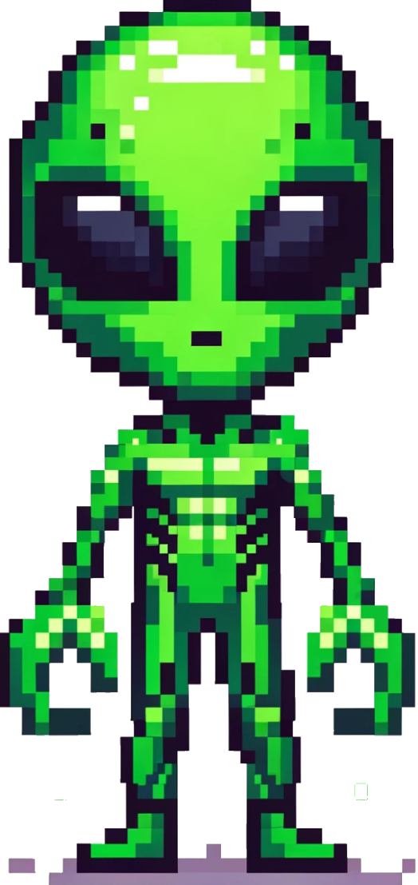

**Cannon Game**
-------
__Overview__

This project is a retro-style artillery game, developed as the final exam project for the course "Computer programming, Algorithms, and Data Structures" at the University of Pavia. 
The player controls a cannon to fire projectiles at targets, considering various physics elements and interactions with obstacles.  

__Gameplay__

The player's objective is to hit a target by adjusting the angle and velocity of projectiles fired from a cannon, navigating through multiple levels of increasing difficulty, with a range of obstacles that affect gameplay.
   

__Game Elements__

**Cannon**: Player-controlled element to aim and adjust projectile speed. 

**Projectiles**: Include Bullets, Bombshells, and Lasers, each with unique properties.             

**Obstacles**: Rock, Perpetio, Mirrors, and Wormholes, each introducing different interactive dynamics.   

**Target**: The primary objective that the player must hit to advance levels. 
   

**Features**

5 levels, each more challenging than the previous one.

Points-based scoring system, rewarding efficiency and strategic gameplay.

Hall of Fame to track top player scores.
   
**Technologies**

**Language**: Python 3.12

**Framework**: Kivy 2.0.0

**IDE**: Visual Studio Code

**Libraries**: Python Standard Math Library, JSON
   
**Structure**

The game follows a modular, object-oriented architecture for improved maintainability and scalability:

Clear separation of responsibilities.

Use of constants for easy adjustments of game parameters.

Animations for interactive and engaging visual feedback.
   
**Game Screens**

**Home**: Navigation hub for game sections.

**Game Page**: Core gameplay area with interactive elements.

**Help Page**: Explanation of rules and game mechanics.

**Record Page**: Displays player's scores and rankings.

   
**How to Run**

Install Python 3.12 and Kivy 2.0.0.

Clone this repository.

Navigate to the project directory.

Run the main file using:

python main.py

## Future Improvements
- Implement procedural level generation.
- Adaptive difficulty system.
- Dynamic and moving targets.

## Author
Andrea Bolis  
AI Student & Automation Expert  
Università degli Studi di Pavia

For questions, reach out at andreabolis64@gmail.com
